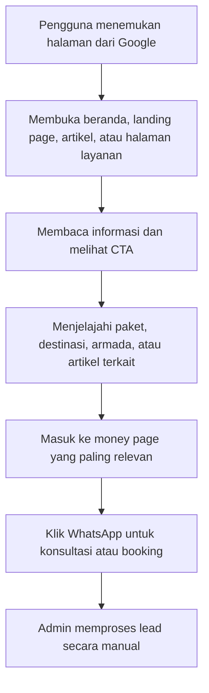

## 1. Gambaran Produk
LombokAdvisor.com adalah platform travel dan wisata Lombok berbasis SEO yang berfungsi sebagai mesin lead generation, pusat informasi destinasi, dan landing page konversi tinggi untuk pasar Indonesia dan internasional.
- Produk difokuskan untuk memenangkan keyword komersial bernilai tinggi seperti sewa mobil, paket wisata, honeymoon, open trip, dan ribuan long-tail keyword wisata Lombok.
- Nilai utama produk adalah kombinasi antara topical authority, struktur halaman yang scalable, CTA WhatsApp yang kuat, dan konten yang membangun trust.

## 2. Fitur Inti

### 2.1 Peran Pengguna
| Peran | Metode Akses | Hak Akses Inti |
|------|--------------|----------------|
| Pengunjung | Tanpa login | Menjelajahi halaman layanan, destinasi, artikel, dan menghubungi via WhatsApp |
| Admin Konten | Login dashboard | Mengelola paket, artikel, destinasi, metadata SEO, galeri, FAQ, dan internal linking |

### 2.2 Modul Fitur
1. **Beranda**: hero SEO, CTA WhatsApp, daftar layanan unggulan, destinasi populer, testimoni, artikel terbaru.
2. **Halaman layanan**: detail paket wisata, sewa mobil, honeymoon, open trip, private trip, CTA konversi.
3. **Halaman destinasi**: informasi destinasi, galeri, FAQ, rekomendasi paket terkait.
4. **Blog SEO**: artikel informasional untuk topical authority, internal linking, dan akuisisi traffic organik.
5. **Landing page intent/kota**: halaman keyword massal untuk intent kota asal, durasi trip, kategori wisata, dan jenis armada.
6. **Sistem CMS konten**: pengelolaan paket, artikel, destinasi, metadata, harga, itinerary, dan aset visual.
7. **Lapisan SEO teknis**: schema markup, sitemap, canonical, metadata dinamis, robots, breadcrumb, dan FAQ.

### 2.3 Detail Halaman
| Nama Halaman | Modul | Deskripsi Fitur |
|-------------|-------|-----------------|
| Beranda | Hero utama | Menampilkan headline utama, subheadline layanan, CTA WhatsApp, CTA lihat paket |
| Beranda | Blok layanan unggulan | Menyorot paket wisata, honeymoon, sewa mobil, open trip |
| Beranda | Blok destinasi | Grid destinasi utama seperti Gili Trawangan, Mandalika, Senggigi, Rinjani, Pink Beach |
| Beranda | Blok social proof | Testimoni, review, foto pelanggan, statistik wisatawan |
| Halaman layanan | Ringkasan layanan | Menampilkan manfaat layanan, harga mulai, itinerary ringkas, FAQ, CTA sticky |
| Halaman layanan | Detail paket | Menampilkan itinerary lengkap, fasilitas, galeri, variasi paket, rekomendasi terkait |
| Halaman sewa mobil | Pilihan armada | Menampilkan jenis armada, kapasitas, harga, area jemput, opsi driver |
| Halaman destinasi | Konten destinasi | Menampilkan overview destinasi, aktivitas, tips, galeri, lokasi, FAQ |
| Blog SEO | Artikel | Menampilkan artikel 1500-3000 kata, FAQ, CTA inline, internal link ke money pages |
| Landing page SEO | Variasi keyword | Menampilkan halaman programatik berbasis template dengan pengantar unik, FAQ, CTA, dan link ke halaman inti |
| Semua halaman | CTA WhatsApp | Floating CTA, sticky CTA, CTA akhir section, CTA dalam artikel |

## 3. Alur Inti
Alur utama produk dimulai dari pengguna menemukan halaman melalui Google, membaca konten layanan atau artikel, lalu diarahkan ke money page yang paling relevan dan berujung pada konversi melalui WhatsApp.

## 4. Desain Antarmuka

### 4.1 Gaya Desain
- Warna utama: biru laut dalam, hijau toska, putih pasir, dan aksen emas hangat untuk memberi nuansa premium-travel.
- Gaya tombol: rounded besar, solid kontras untuk CTA utama, outline lembut untuk CTA sekunder.
- Tipografi: display serif elegan untuk headline dan sans-serif modern yang bersih untuk konten.
- Tata letak: desktop-first, grid editorial lebar, section visual kuat, card modular untuk halaman kategori.
- Gaya ikon/visual: ikon outline sederhana, foto perjalanan asli, pattern peta/topografi Lombok yang halus.

### 4.2 Ikhtisar Desain Halaman
| Nama Halaman | Modul | Elemen UI |
|-------------|-------|-----------|
| Beranda | Hero | Visual destinasi besar, headline SEO, CTA utama, statistik singkat |
| Beranda | Layanan unggulan | Card layanan dengan harga mulai, manfaat, CTA |
| Halaman layanan | Konten utama | Sidebar sticky CTA, daftar fasilitas, itinerary accordion, testimonial |
| Halaman destinasi | Konten destinasi | Gallery masonry, info singkat, FAQ, rekomendasi paket |
| Blog SEO | Artikel | Tipografi nyaman baca, TOC, FAQ, CTA inline, related links |
| Landing page SEO | Template programatik | Hero ringan, USP, variasi intent, FAQ, CTA, link ke cluster utama |

### 4.3 Responsivitas
- Pendekatan desktop-first dengan adaptasi mobile penuh.
- CTA WhatsApp tetap mudah dijangkau di layar kecil.
- Layout artikel, card layanan, dan navigasi harus tetap nyaman di tablet dan mobile.
- Gambar dioptimalkan dengan lazy loading dan ukuran responsif.

## 5. Sasaran Bisnis Dan SEO
- Menghasilkan lead harian stabil dari traffic organik.
- Membangun minimal 1000 halaman terindeks dalam 6-12 bulan melalui kombinasi halaman inti, landing page massal, dan blog SEO.
- Menjadikan LombokAdvisor sebagai authority site niche travel Lombok untuk pasar domestik, lalu berkembang ke pasar internasional berbahasa Inggris.

## 6. KPI Utama
- 6 bulan: 1000 halaman terindeks, 50 keyword halaman 1, 10.000 traffic organik per bulan.
- 12 bulan: 100.000 traffic organik per bulan, dominasi keyword travel Lombok, lead harian stabil.

## 7. Batasan Dan Prinsip Produk
- Semua CTA utama diarahkan ke WhatsApp, bukan booking engine kompleks pada fase awal.
- Semua konten AI wajib melalui editing manusia.
- Konten layanan harus lebih kuat pada trust, social proof, dan kejelasan penawaran dibanding kompetitor.
- Struktur URL harus singkat, keyword-first, dan bebas query parameter untuk halaman indeks utama.
