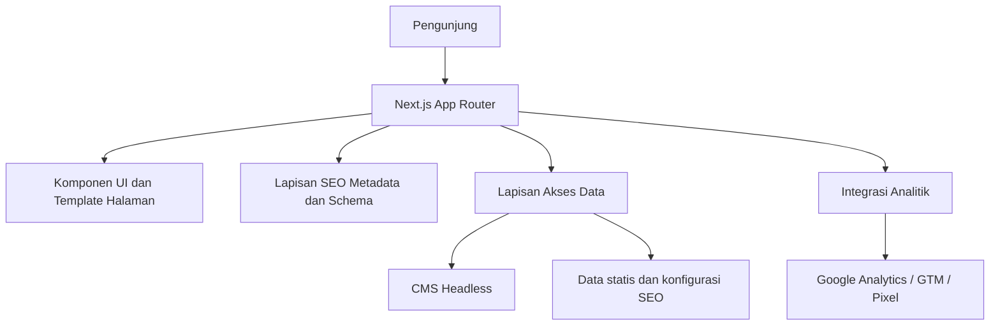
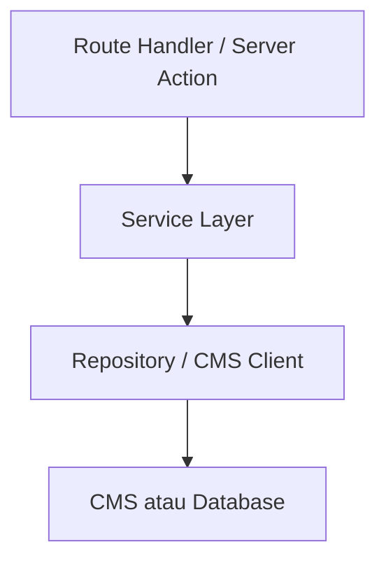
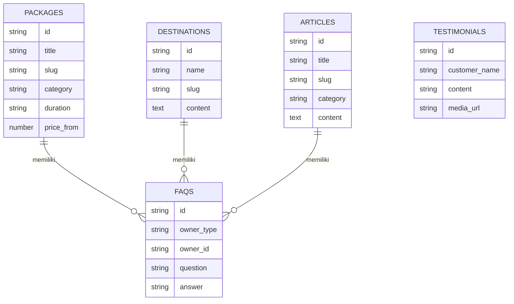

## 1. Desain Arsitektur
Website menggunakan Next.js App Router sebagai fondasi frontend dan server rendering, dengan CMS headless untuk pengelolaan konten, serta lapisan SEO teknis yang dibangun langsung di aplikasi.



## 2. Deskripsi Teknologi
- Frontend: Next.js + React + TypeScript + Tailwind CSS.
- Routing: Next.js App Router dengan segment route untuk layanan, destinasi, blog, dan landing page.
- Data fetching: server components untuk konten utama, client components untuk interaksi ringan.
- CMS: Sanity atau Strapi sebagai kandidat utama untuk pengelolaan artikel, paket, destinasi, testimonial, dan galeri.
- Deployment: VPS production dengan reverse proxy dan CDN Cloudflare.
- Media: image optimization Next.js dan aset WebP.

## 3. Definisi Route
| Route | Tujuan |
|-------|--------|
| `/` | Beranda utama dengan hero SEO, layanan unggulan, destinasi, testimoni, dan artikel terbaru |
| `/paket-wisata-lombok` | Halaman money page utama untuk paket wisata |
| `/paket-tour-lombok` | Variasi layanan paket tour Lombok |
| `/paket-honeymoon-lombok` | Halaman money page honeymoon |
| `/sewa-mobil-lombok` | Halaman money page sewa mobil utama |
| `/rental-mobil-lombok` | Variasi keyword rental mobil |
| `/wisata/[slug]` | Template halaman destinasi |
| `/blog/[slug]` | Template artikel SEO |
| `/kategori/[slug]` | Template kategori blog atau cluster topik |
| `/dari-[kota]/[slug]` | Landing page intent lokal berdasarkan kota asal |
| `/[kategori-layanan]/[slug]` | Landing page programatik untuk variasi intent, durasi, atau tipe layanan |

## 4. Definisi API
Backend kompleks tidak wajib pada fase awal karena CTA utama diarahkan ke WhatsApp. Namun aplikasi tetap membutuhkan lapisan akses data yang konsisten untuk konten.

### 4.1 Tipe Data Inti
```ts
type SeoFields = {
  title: string;
  description: string;
  canonical?: string;
  ogImage?: string;
  keywords?: string[];
};

type PackageItem = {
  id: string;
  title: string;
  slug: string;
  category: "tour" | "honeymoon" | "open-trip" | "private-trip";
  duration: string;
  priceFrom: number;
  summary: string;
  itinerary: string[];
  inclusions: string[];
  heroImage: string;
  seo: SeoFields;
};

type DestinationItem = {
  id: string;
  name: string;
  slug: string;
  summary: string;
  content: string;
  gallery: string[];
  tags: string[];
  seo: SeoFields;
};

type ArticleItem = {
  id: string;
  title: string;
  slug: string;
  category: string;
  excerpt: string;
  content: string;
  faq: { question: string; answer: string }[];
  relatedLinks: string[];
  seo: SeoFields;
};
```

### 4.2 Kontrak Akses Data
| Fungsi | Tujuan |
|--------|--------|
| `getHomePageData()` | Mengambil data beranda dan blok unggulan |
| `getPackageBySlug(slug)` | Mengambil detail paket layanan |
| `getDestinationBySlug(slug)` | Mengambil detail destinasi |
| `getArticleBySlug(slug)` | Mengambil detail artikel SEO |
| `getRelatedContent(type, slug)` | Mengambil konten terkait untuk internal linking |
| `getLandingPageData(params)` | Mengambil data template landing page massal |

## 5. Diagram Arsitektur Server
Jika fase berikutnya membutuhkan API internal, struktur server direkomendasikan tetap sederhana dan modular.



## 6. Model Data

### 6.1 Definisi Model Data


### 6.2 Definisi Data Awal
```sql
CREATE TABLE packages (
  id UUID PRIMARY KEY,
  title VARCHAR(255) NOT NULL,
  slug VARCHAR(255) UNIQUE NOT NULL,
  category VARCHAR(100) NOT NULL,
  duration VARCHAR(100),
  price_from NUMERIC(12,2),
  summary TEXT,
  itinerary JSONB,
  hero_image TEXT,
  seo_title VARCHAR(255),
  meta_description TEXT
);

CREATE TABLE destinations (
  id UUID PRIMARY KEY,
  name VARCHAR(255) NOT NULL,
  slug VARCHAR(255) UNIQUE NOT NULL,
  summary TEXT,
  content TEXT,
  gallery JSONB,
  seo_title VARCHAR(255),
  meta_description TEXT
);

CREATE TABLE articles (
  id UUID PRIMARY KEY,
  title VARCHAR(255) NOT NULL,
  slug VARCHAR(255) UNIQUE NOT NULL,
  category VARCHAR(100),
  excerpt TEXT,
  content TEXT,
  faq JSONB,
  seo_title VARCHAR(255),
  meta_description TEXT
);
```

## 7. Struktur Project Yang Direkomendasikan
```text
src/
  app/
    (marketing)/
      page.tsx
      paket-wisata-lombok/page.tsx
      paket-honeymoon-lombok/page.tsx
      sewa-mobil-lombok/page.tsx
      wisata/[slug]/page.tsx
      blog/[slug]/page.tsx
  components/
    layout/
    sections/
    cards/
    seo/
    ui/
  lib/
    cms/
    seo/
    routes/
    analytics/
  data/
    seed/
    config/
  types/
```

## 8. Prinsip Implementasi
- Semua halaman utama harus mendukung metadata dinamis.
- Semua template harus mudah diperluas untuk landing page massal.
- Komponen SEO, CTA, FAQ, dan social proof harus reusable.
- Struktur data harus mendukung Indonesia dan English sejak awal walau peluncuran awal fokus ke Indonesia.
